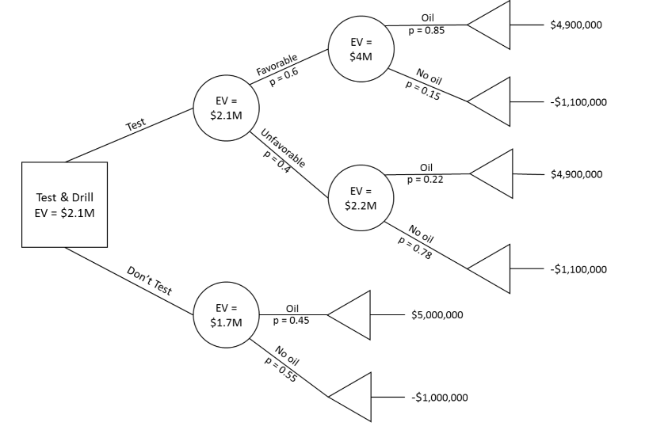

```{r setup, include=FALSE}
knitr::opts_chunk$set(warning=FALSE, message=FALSE, fig.align='center', comment=NA, echo=FALSE)
```

## Section 9.1, Problem 4
There are only two possible outcomes, so the probability of failure is $P(f) = 1 - P(s) = 3/5$.  Thus, $$E = w_sp_s + w_fp_f = \frac{2}{5} \times 55000 + \frac{3}{5} \times (-1750) = 20950$$


## Section 9.1, Problem 6
The expected values of the two policies are based on the temperature and the profits:
$$\begin{aligned}
E(cola) &= 0.3 \times 1500 + 0.7 \times 5000 = 3950\\
E(coffee) &= 0.3 \times 4000 + 0.7 \times 1000 = 1900
\end{aligned}$$
The expected value of selling cola is higher; therefore the firm should purchase cola.  This makes intuitive sense, as cola has a higher profit under the more likely weather scenario.  This is further illustrated in the decistion tree below.


## Section 9.2, Problem 3
Basedon the on the decision tree presented below, the resort should be operated.  This decision has an expected value of \$116,000.


\newpage
## Section 9.3, Problem 3
If oil is found, the net profit is \$6M - \$1M = \$5M.  If no oil is found, a -\$1M net profit (i.e. a \$1M loss) is realized.  If a geologist is hired to perform testing, each of these profit numbers is lowered by \$0.1M (resulting in a \$4.9M profit and \$1.1M loss).  This information is reflected in teh decision tree below:



As indicated in the decision tree, the oil company should hire a geologist to perform testing.  It is indicated that they should drill -- this is because the expected value (profit) is greater than 0.


\newpage
## Section 9.4, Problem 1
### Part a
The expected values are given by $\sum w_ip_i$ for the table:
$$\begin{aligned}
E(A) &= 0.35 \times 1100 + 0.3 \times  900 + 0.25 \times  400 + 0.1 \times 300 = 785\\
E(B) &= 0.35 \times  850 + 0.3 \times 1500 + 0.25 \times 1000 + 0.1 \times 500 = 1047.50\\
E(A) &= 0.35 \times  700 + 0.3 \times 1200 + 0.25 \times  500 + 0.1 \times 900 = 820
\end{aligned}$$

The highest expected value is for alternative B, so that should be chosen if the criteria is maximized expected value.

### Part b
The regret table is composed by selecting each entry from the column maximum to get the regret under each state of nature.  The expected regret is then calculated by $\sum r_ip_i$:

```{r, echo=TRUE}
# enter payoffs and probabilities
X <- matrix(
  c(1100,  900,  400, 300,
     850, 1500, 1000, 500,
     700, 1200,  500, 900),
  nrow = 3, byrow = TRUE)
p <- c(0.35, 0.3, 0.25, 0.1)
# get regret matrix
reg <- apply(X, 2, function(x) {max(x) - x})
# calculate expected regrets
reg <- cbind(reg, apply(reg, 1, function(x) {sum(x * p)}))
```

```{r}
dimnames(reg) <- list(LETTERS[1:3], c(as.character(1:4), "Expected Regret"))
pander::pander(reg)
```

The lowest expected regret occurs for alternative B, so this should also be selected if the criteria is minimized expected regret.