```{r setup, include=FALSE}
knitr::opts_chunk$set(echo = FALSE)
```

```{r}
suppressMessages(suppressWarnings(library(knitr)))
suppressMessages(suppressWarnings(library(ggplot2)))
suppressMessages(suppressWarnings(library(ggthemes)))
suppressMessages(suppressWarnings(library(dplyr)))
suppressMessages(suppressWarnings(library(tidyr)))
suppressMessages(suppressWarnings(library(stringr)))
suppressMessages(suppressWarnings(library(lpSolveAPI)))
suppressMessages(suppressWarnings(library(xts)))
suppressMessages(suppressWarnings(library(matrixcalc)))
suppressMessages(suppressWarnings(library(dygraphs)))
suppressMessages(suppressWarnings(library(ggthemes)))
suppressMessages(suppressWarnings(library(highcharter)))
suppressMessages(suppressWarnings(library(viridis)))
suppressMessages(suppressWarnings(library(tibbletime)))
suppressMessages(suppressWarnings(library(timetk)))
suppressMessages(suppressWarnings(library(tidyquant)))
suppressMessages(suppressWarnings(library(tidyverse)))

```

## Data 609 Project proposal - Mathematical Modeling Techniques for Data Analytics

Title: Portfolio Optimization

Aim:
- Use mathematical models to make a decision for portfolio optimization
- Investigating portfolio optimization with expected return on investiment in risk control

## Data source:

- Historical stock price data are readily accessible using functions in "Quantmod" package
- The filtered data for this application selects total 9 stock cases from 2017 to August 2018
- The datasets include the date, daily market close price, market volumes, the closing price will be used to make for portfolio optimization

## Sections

In the following sections, we use a variety of mathematical tools to perform the following tasks: 

- Data loading
- Graphical Exploration
- Compute daily, monthly and yearly return
- Calculate the Mean Variance model by specific stocks
- Use minimax model to optimize portfolio
- Use linear programming techniques to compare the log return
- Use a quadratic programming approach to determine appropriate portfolio weights

## 1. Loading data

Construct a vector of tickers and gather prices for them using the getSymbols function within quantmod. We will next calculate returns and convert the data to a time series object.

```{r}
# input and print available stocks 

symbols <- c("AAPL", "AMD", "ADI",  "ABBV", "AET", "A",  "APD", "AA","CF")
stock <- c("Apple Inc.", "Advanced Micro Devices, Inc.", "Analog Devices, Inc.", "AbbVie Inc","AETNA INC", "Agilent Technologies Inc","Air Products & Chemicals, Inc.","Alcoa Corp","CF Industries Holdings, Inc.")
df <- data.frame(ticker=symbols, stocks=stock)
knitr::kable(df[,1:2], col.names = c("Ticker","Stocks"))  
```  

## Use Ajusted closed price to Calculate Returns

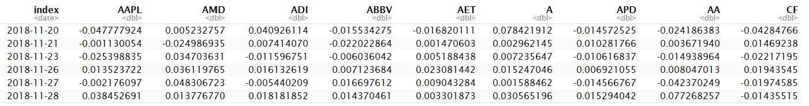

```{r}
tickers <- c("AAPL", "AMD", "ADI",  "ABBV", "AET", "A",  "APD", "AA","CF")
# The prices object will hold our raw price data
close_price<- 
  getSymbols(tickers,src="yahoo", from = "2017-01-01") %>% 
  map(~Ad(get(.))) %>%   
  reduce(merge) %>%   
  `colnames<-`(tickers )

```

## Graphical Exploration
Use adjusted closed price to plot graph from 2017 until now:

```{r}
dateWindow <-cat(paste(sQuote("2017-01-01"),sQuote(today()),sep=","), "\n")
dygraph(close_price, main = "Value", group = "stock") %>%
  dyRebase(value = 100) %>%
  dyRangeSelector(dateWindow = dateWindow)


```

## 2. Compute daily, monthly and yearly return

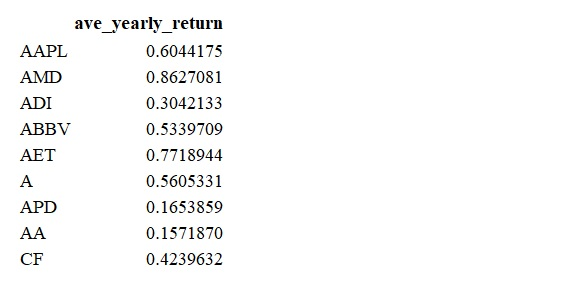
To compare the average yearly return, AMD and AET are the most increasing return yearly.

## 3.Linear Programming - Mean Variance model

Investors are risk averse in that they prefer higher return for a given level of risk (variance, standard deviation), or they want to minimize risk for a given level of returns, so we go to minimize the variance and maximize the return.
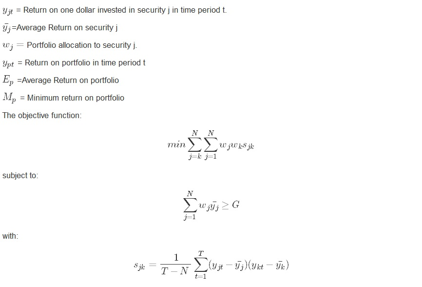

## Calculation of Mean Variance model
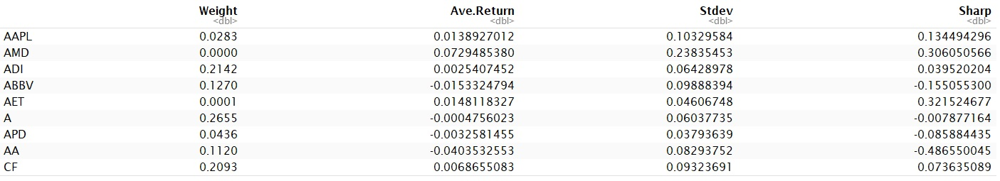
The average monthly return of the portofolio at the evenly distributed allocation is 6.8 %. After optimization, the average monthly return of portfolio is -0.436 % when the global variance is at minimum 0.048. The maximized monthly return of portfolio is 1.904 % when the global variance is 0.0915.

## 4.Linear Programming - Minimax Model

The minimax model will maximize return with respect to one of these prior distributions providing valuable insight regarding an investor's risk attitude and decision behavior.
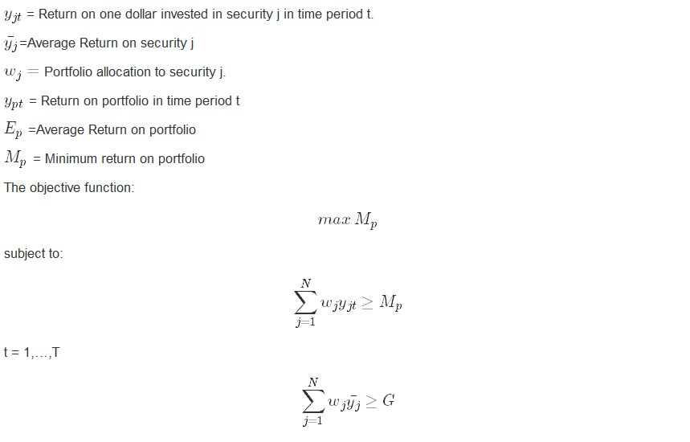

## Calculation of Minimax Model
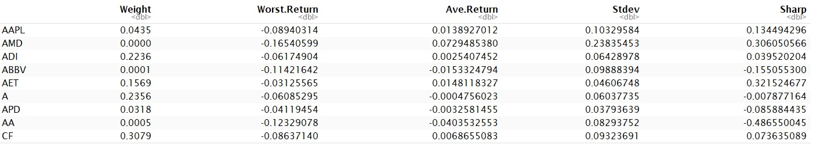
Average monthly return is 8.6%, After optimization, mininum average loss is 6.49 % when variance is 1e+07.

## 5. linear programming vs log returns:
Modeling linear vs log returns:
Now we are ready to obtain the sample estimates from the returns$\mathbf{x}_t$
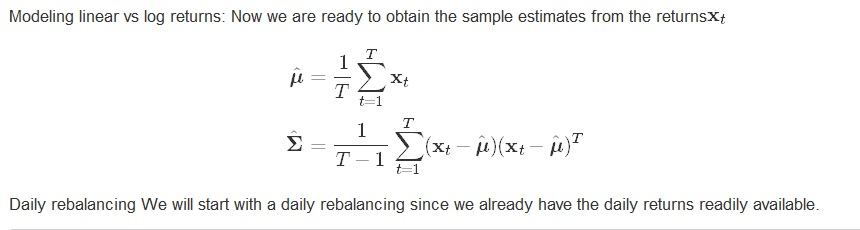

## Daily rebalancing
We will start with a daily rebalancing since we already have the daily returns readily available.

Compute the three corresponding GMV portfolios:
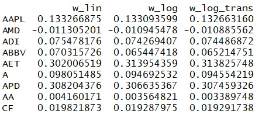

## compare the allocations

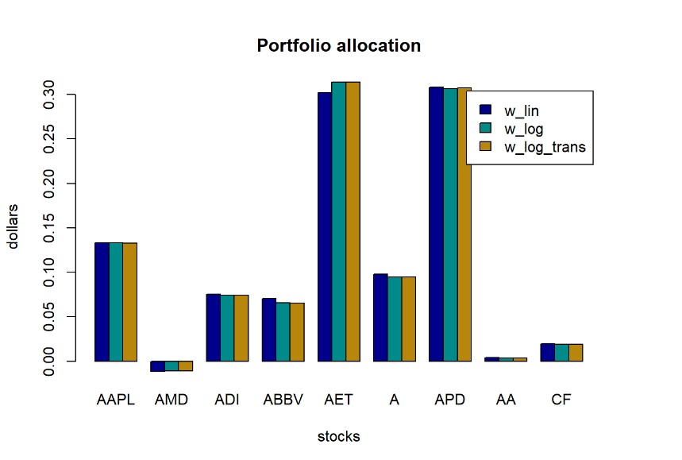

By portfolio allocation, AAPL, AET and APD are shown the most positive in investing value, but it is not significate in difference between log and tranformation. 

## 6. Qudratic programming

- Uniform portfolio:
The uniform portfolio allocation

- Global Minimum Variance Portfolio (GMVP):
$$ \begin{array}{ll}
\underset{\mathbf{w}}{\textsf{minimize}} & \mathbf{w}^T\mathbf{\Sigma}\mathbf{w}\\
{\textsf{subject to}}
 & \mathbf{1}^T\mathbf{w} = 1\\
 & \mathbf{w}\ge\mathbf{0}
\end{array}$$tes equal weight to each stock: $\mathbf{w} = \frac{1}{N}\mathbf{1}$

- Markowitz portfolio:
$$\begin{array}{ll}
\underset{\mathbf{w}}{\textsf{maximize}} & \boldsymbol{\mu}^T\mathbf{w} -\lambda\mathbf{w}^T\mathbf{\Sigma}\mathbf{w}\\
{\textsf{subject to}}
 & \mathbf{1}^T\mathbf{w} = 1\\
 & \mathbf{w}\ge\mathbf{0}
\end{array}$$

## Return-risk tradeoff for all portfolios
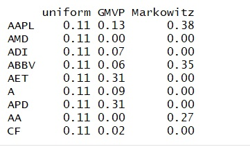

## compare the weight of allocations

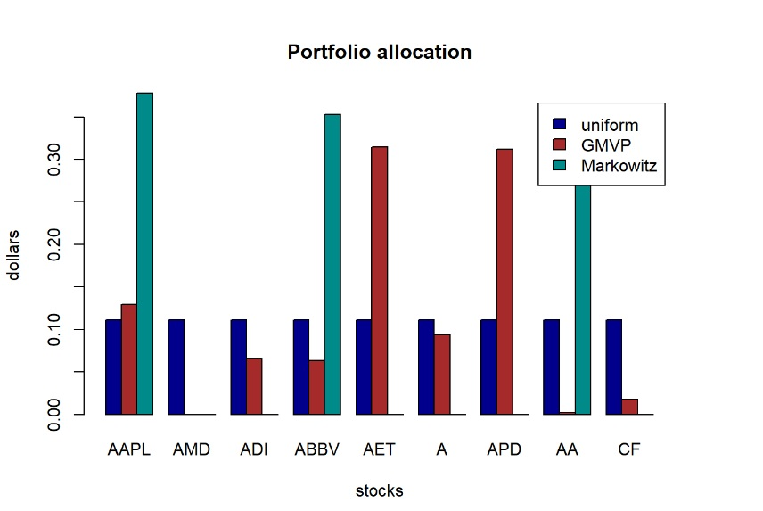

## compare the performance:
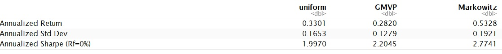

## Return Performance of different portfolios
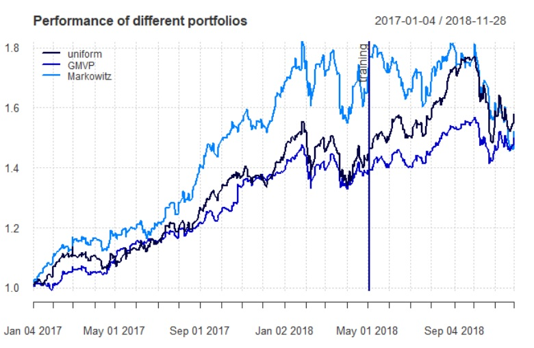

## plot the expected return vs the standard deviation along with the efficient frontier

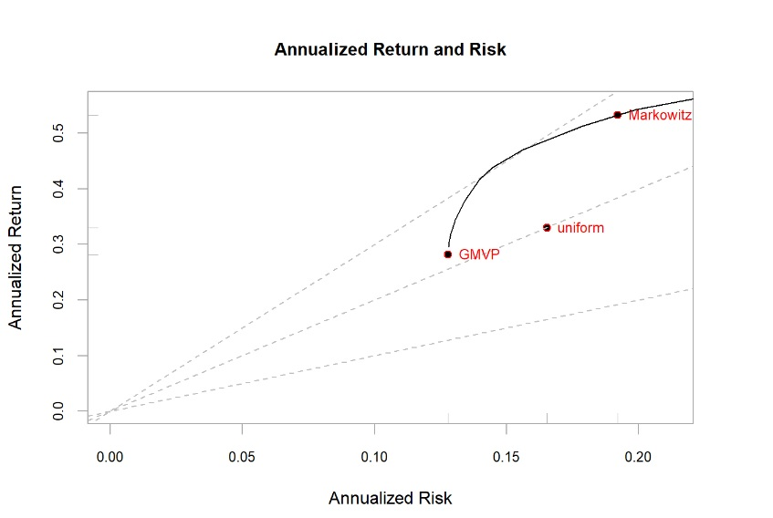

## Conclusion
### Conclusion
We can conclude with the following points:

- To compare the average yearly return, AMD and AET are the most increasing return yearly.
- It seems that using linear returns or log-returns does not make any significant difference for daily, weekly, and monthly returns.
- Mean-variance Markowitz portfolio has larger annualized return and risk, and Global Minimum Variance Portfolio (GMVP) has lower annualized return and risk.

